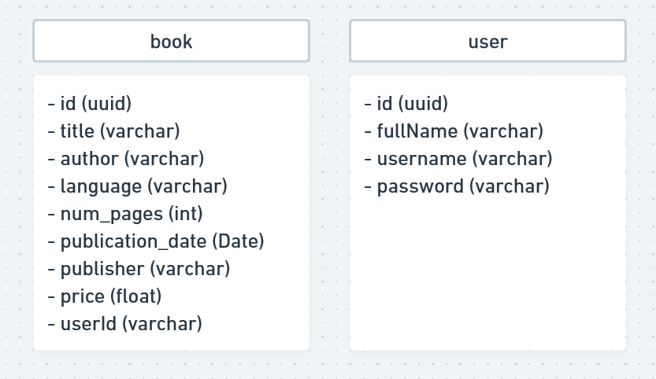

# 📚 API Bookstore 📚

  
### Descrição

 - Projeto de API REST para alimentação do projeto final (módulo 5) da formação em Desenvolvimento Web Full Stack @ Resilia. 
 - O projeto é uma adaptação do projeto do módulo 4 e interage com informações do banco de dados de uma livraria, com a intenção de criar um sistema de estoque. 
 - As principais mudanças em relação ao módulo passado foram: 
   - escolha de duas entidades: book e user
   - uso de banco de dados não-relacional.

### Modelagem do banco de dados

  
  

### Como executar o projeto
- Você precisa ter instalada em sua máquina a versão 16.14.0 do NodeJS, o VSCode e o Insomnia;
- Faça clone do seguinte repositório:
 
    ```js
    git clone https://github.com/carollyb/bookstore-api.git
    ```

- Abra o projeto no VSCode, abra o terminal e assegure-se que está na pasta `bookstore-api`. Caso esteja em uma pasta acima, execute o seguinte comando:
  ```js
  cd bookstore-api
-  Instale as dependências
     ```js
     npm install
- Renomeie o arquivo de `.env.example` para `.env` na pasta raiz do projeto, e coloque a conexão com o banco de dados
- Inicie o projeto
   ```js
   npm start


### Estrutura da API: rotas possíveis
#### Livros (entidade book)
<span style="color: green"> POST: </span>
  - /books (Cria um cadastro de um novo livro. Deve passar o objeto no corpo da requisição. O id não é necessário pois é gerado automaticamente através da biblioteca uuid)
  
<span style="color: purple"> GET: </span> 
  - /books (Lista todos os títulos cadastrados)
  - /books/`:title` (Lista títulos que sejam exatamente iguais ao título passado como parâmetro)

<span style="color: orange"> PUT: </span>
  - /books/`:id` (Atualiza todos os atributos de um livro cadastrado. Deve passar o objeto com todos os atributos no corpo da requisição, com exceção do id, que não deve ser alterado manualmente)

<span style="color: yellow"> PATCH: </span>
  - /books/`:id` (Atualiza um ou mais atributos de um livro cadastrado, com exceção do id. Deve passar um ou mais atributos no corpo da requisição, e o id como parâmetro)

<span style="color: red"> DELETE: </span>
  - /books/`:id` (Deleta um livro do banco de dados. Deve passar o id do livro como parâmetro)

#### Usuários (entidade user)
<span style="color: green"> POST: </span>
  - /user (Cria um cadastro de um novo usuário. Deve passar o objeto no corpo da requisição. O id não é necessário pois é gerado automaticamente através da biblioteca uuid)
  
<span style="color: purple"> GET: </span> 
  - /user (Lista todos os usuários cadastrados)
  - /user/`:username` (Lista usuários cujo username seja exatamente igual ao username passado como parâmetro)

<span style="color: orange"> PUT: </span>
  - /user/`:id` (Atualiza todos os atributos de um user cadastrado. Deve passar o objeto com todos os atributos no corpo da requisição, com exceção do id, que não deve ser alterado manualmente)

<span style="color: yellow"> PATCH: </span>
  - /user/`:id` (Atualiza um ou mais atributos de um user cadastrado, com exceção do id. Deve passar um ou mais atributos no corpo da requisição, e o id como parâmetro)

<span style="color: red"> DELETE: </span>
  - /user/`:id` (Deleta um usuário do banco de dados. Deve passar o id do user como parâmetro)

#### Rota de autenticação
<span style="color: green"> POST: </span>
  - /login (Faz o login do usuário. Deve passar o objeto no corpo da requisição e o usuário deve estar previamente cadastrado. Caso sucesso, retorna o token)

### Exemplos de endpoints
- Endpoint da requisição do cadastro de um novo livro:
  ```js
  {
	"id": "f4d8510a-9e5b-40a4-9e38-8aea2917a2be",
	"title": "Sample Book",
	"author": "Sample Author",
	"language": "English",
	"num_pages": 20,
	"publication_date": "1927-12-12T00:00:00.000Z",
	"publisher": "Sample Publisher",
    "price": 49.90,
    "userId": "a96a48d0-ea28-4500-abae-f3571f2218a3"
  }
  ```
- Endpoint de tentativa de cadastro de livro com título que já existe:
  ```js
  {
	"error": "This book already exists on our database"
  }
  ```
- Endpoint de cadastro de usuário:
  ```js
  {
    "id": "a96a48d0-ea28-4500-abae-f3571f2218a3",
    "fullName":"sample user sample",
    "username": "sampleuser",
    "password":"$2a$08$8FJexA0SdMV1fYpa3Dl/4.Z/If8Ft0xp7FQsuXvYkH177dx7cpTMS"
  }

### Deploy

[Heroku-API-Bookstore](https://api-bookstore-mod5.herokuapp.com/)

### Tecnologias utilizadas


- NodeJS
- Express
- Prisma ORM
- MongoDB
- Insomnia

- Bibliotecas: 
  - Joi (validação de campos)
  - JWT (autenticação com token)
  - Bcrypt (encriptação da senha)
  - Cors (permitir o consumo pelo frontend)
  - uuid (geração de ids automáticos)

